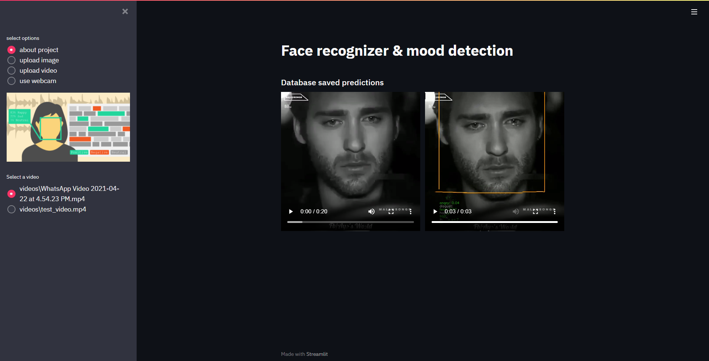
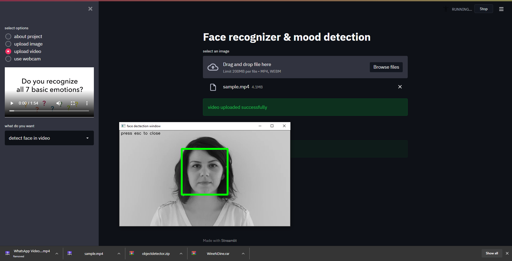
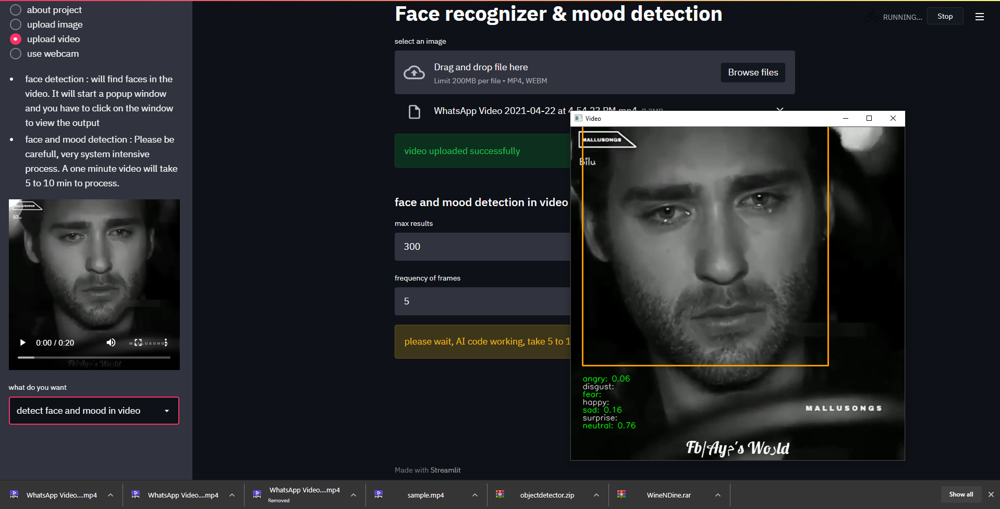

# face recognition and mood detection









- install libraries
```bash
pip install -r requirements.txt
```
- run db.py to create database with table
- run project app
```bash
streamlit run app.py
```